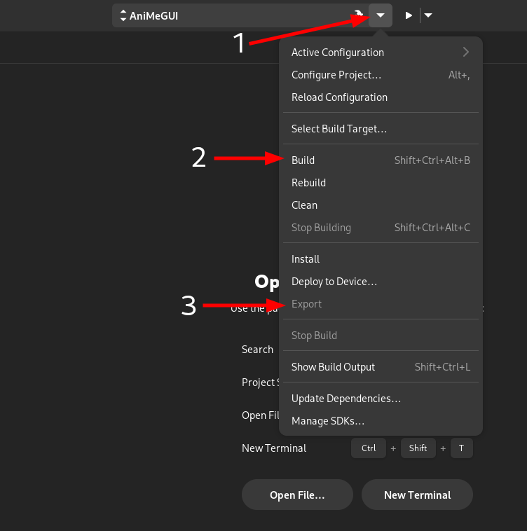

    <h1>AniMeGUI</h1>
    <h4>Control your AniMe Display graphically on Linux!</h4>
    

AniMeGUI is a GUI wrapper for [asusctl](https://gitlab.com/asus-linux/asusctl/-/tree/main/) for controlling the AniMe
Matrix™ Display graphically on Linux. Requires [asusctl](https://gitlab.com/asus-linux/asusctl/-/tree/main/) to be
installed in the host system and the AniMe Display (only Zephyrus G14 laptops).

**This project is not officially affiliated with either ASUS or the asus-linux team.**

* [Features](#features)
* [Installation](#installation)
* [Development](#development)
    * [Compiling](#compiling)
    * [Dependencies](#dependencies)

## Features

- Control the AniMe functionalities of `asusctl` graphically
- Save presets of your favourite animations/images
- Use your webcam (if you have one) and display it to the AniMe display

## Installation

**Currently the only supported way of installing this app is by using GNOME Builder. There are plans to at least include
the flatpak file in this repository so that you can just download that and install it.**

1. Open GNOME Builder and select `Clone Repository`
2. In the `Repository URL` field, copy and paste this repo's URL: `https://github.com/izzthedude/AniMeGUI` and
   click `Clone Repository`
3. Navigate to this menu, click `Build`, wait for it to finish, then click `Export` (this may take a while)
   
4. After the export finishes, it should open the file manager and highlight the flatpak file. Double-click it (this will
   open GNOME Software) and click `Install`
5. It will ask for authentication twice (idk why). Just enter your password and wait for it to install (this may also
   take a
   little while)
6. Launch the app (either from GNOME Software or the app grid or whatever)

## Development

### Compiling

Use GNOME Builder to build and run the app. If you prefer to use a different IDE to write code, refer to
the [Dependencies](#dependencies) section to install necessary packages for code suggestions etc.

### Dependencies

- Python 3.10.6 (included in GNOME runtime)
- PyGObject 3.44.1
- deepface 0.0.79