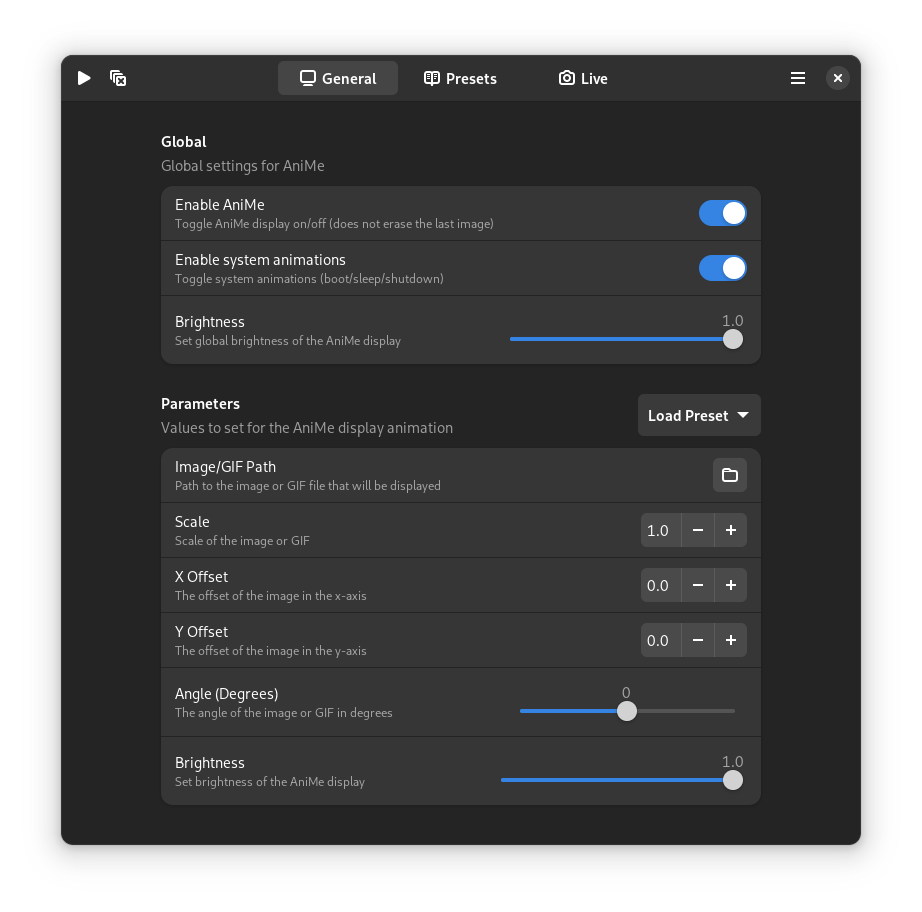

    <h1>AniMeGUI</h1>
    <h4>Control your AniMe Display graphically on Linux!</h4>
    

AniMeGUI is a GUI wrapper for [asusctl](https://gitlab.com/asus-linux/asusctl/-/tree/main/) for controlling the AniMe
Matrix™ Display graphically on Linux. Requires [asusctl](https://gitlab.com/asus-linux/asusctl/-/tree/main/) to be
installed in the host system and the AniMe Display (only Zephyrus G14 laptops).

**This project is not officially affiliated with either ASUS or the asus-linux team.**

* [Features](#features)
* [Installation](#installation)
* [Development](#development)
    * [Compiling](#compiling)
    * [Dependencies](#dependencies)

## Features

- Control the AniMe functionalities of `asusctl` graphically
- Save presets of your favourite animations/images
- Use your webcam (if you have one) and display it to the AniMe display

## Installation

1. Download
   the [flatpak](https://github.com/izzthedude/AniMeGUI/releases/download/v0.1.0-alpha/io.github.izzthedude.AniMeGUI.flatpak).
   This can be found in this repo's [Releases](https://github.com/izzthedude/AniMeGUI/releases).
2. Install the flatpak with one of two ways:
    - Double-click on the flatpak file and install it through the software centre app. This will ask for authentication
      twice due to flatpak needing to configure stuff to install it.
    - Open a terminal and run: `flatpak --user install /path/to/io.github.izzthedude.AniMeGUI.flatpak`

## Development

### Compiling

Use GNOME Builder to build and run the app. If you prefer to use a different IDE to write code, refer to
the [Dependencies](#dependencies) section to install necessary packages for code suggestions etc.

### Dependencies

- Python 3.10.6 (included in GNOME runtime)
- PyGObject 3.44.1
- deepface 0.0.79